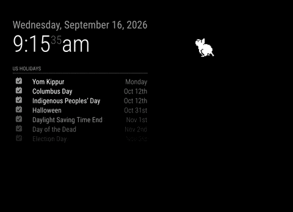
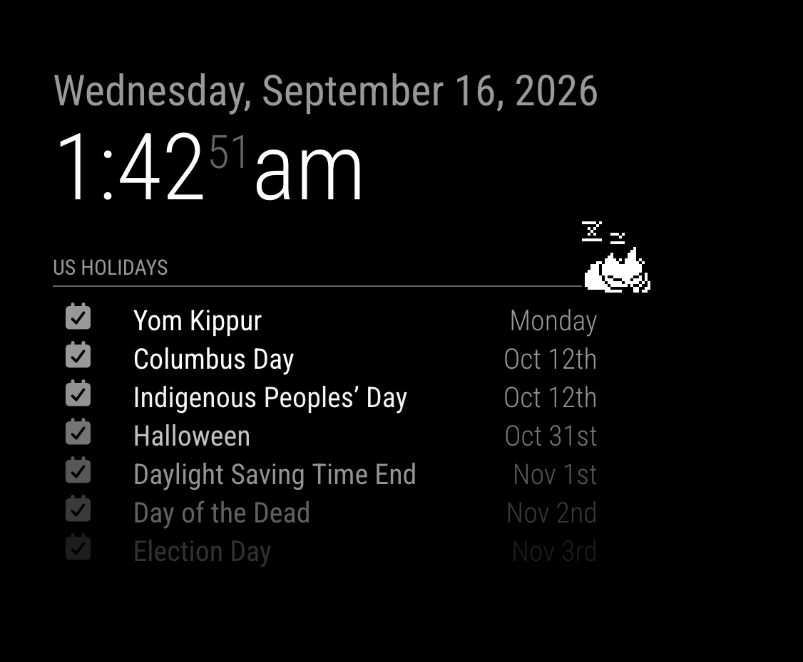

# MMM-Neko

A classic pixel-art Neko cat for an ordinary MagicMirror² installation. One cat
wanders over the mirror, pauses, scratches, and sleeps. It needs no pointer,
other module, hardware, account, or service. All pixels and code are bundled.

The transparent `fullscreen_above` overlay is click-through, including over the
cat. Underlying modules keep their mouse, touch, and keyboard behavior. Neko is
decorative, excluded from the accessibility tree, and never receives focus.



Neko in action, wandering over the mirror while the other modules continue displaying normally.



Neko takes a nap while the other modules continue displaying normally (scale=2, 64x64 sprite).

Prefer a dog? Set `character: "dog"` to use the classic oneko dog sprites.
Use `character: "tora"` for the classic striped cat. The original cat remains
the default; only one pet is displayed at a time.

## Installation

Clone this repository into your MagicMirror modules directory:

```sh
cd ~/MagicMirror/modules
git clone https://github.com/bwente/MMM-Neko.git
```

Alternatively, copy this repository into `MagicMirror/modules/MMM-Neko` (the
folder name must match exactly).

No `npm install`, build step, node helper, CDN, or runtime network request is
required by this module. Use the Node version required by your MagicMirror
installation. The unit tests support Node 20 or later.

## Update

```sh
cd ~/MagicMirror/modules/MMM-Neko
git pull --ff-only
```

Restart MagicMirror after updating. If Git reports conflicting local changes,
resolve those changes before retrying the update. No dependency installation or
asset build is needed to run the module.

## Configuration

Add this entry to the `modules` array in your own MagicMirror `config/config.js`,
then restart MagicMirror:

```javascript
{
  module: "MMM-Neko",
  position: "fullscreen_above",
  config: {
    mode: "wander"
  }
},
```

Configure only one instance. Do not set a module header. Keep your personal
MagicMirror configuration outside this repository.

To choose the dog, use:

```javascript
{
  module: "MMM-Neko",
  position: "fullscreen_above",
  config: {
    character: "dog",
    scale: 2
  }
},
```

### Options

All options go inside `config`. Times are **seconds**, distances are **CSS
pixels**, and speed is independent of sprite scale.

| Option | Default | Accepted values / meaning |
| --- | --- | --- |
| `character` | `"cat"` | `"cat"`, `"dog"`, or `"tora"` (striped cat); restart MagicMirror after changing it |
| `mode` | `"wander"` | `"wander"`, `"mouse"`, `"touch"` |
| `scale` | `1` | Integer 1–4; scales the original 32 × 32 sprite |
| `speed` | `32` | 1–200 pixels per second |
| `idleMin` | `4` | 1–300 seconds; minimum pause before scratching |
| `idleMax` | `10` | 1–300 seconds, at least `idleMin`; maximum pause |
| `sleepAfter` | `60` | 5–3600 active seconds before sleeping |
| `sleepDuration` | `30` | 1–3600 seconds asleep |
| `startPosition` | `{ x: 0.5, y: 0.7 }` | Exactly `x` and `y`, each a number 0–1 within the usable movement area |
| `inset` | `16` | 0–500 pixels between the sprite box and viewport edges |
| `reducedMotion` | `"auto"` | `"auto"`, `"always"`, `"never"` |

All characters use 32 × 32 source frames, so scales 1–4 give sprite boxes of
32, 64, 96, or 128 pixels per side. They share the same behavior, timings,
input handling, reduced-motion support, and `NEKO_*` notifications.

Invalid values fall back individually to defaults; unknown keys are ignored.
If the idle range is reversed, both idle values return to their defaults.
Numbers must be finite numbers, not numeric strings. Validation is available as
`NekoEngine.validateConfig(config)`, returning `{ config, invalid }` for tests or
developer inspection. Invalid configuration does not display errors on the mirror.

`wander` chooses viewport targets without input. Between trips it waits for a
random duration within the idle range, scratches for two seconds, then moves.
After `sleepAfter` active seconds it sleeps, wakes, and repeats. Sleep can
interrupt a trip. Suspended, hidden, and paused time does not count.

`mouse` observes mouse pointer movement; `touch` observes primary touch-down
positions. Each target is clamped to the viewport. Input wakes the cat and
resets its awake timer. Movements within eight pixels of its current center
are ignored. After arriving, it returns to autonomous activity; both optional
modes work without continuous input. Input uses passive capture listeners and
never cancels an event, captures a pointer, or changes cursor/touch behavior.
Keyboard control of underlying modules is unaffected; Neko adds no controls.

`auto` respects `prefers-reduced-motion` and responds to changes immediately.
Reduced motion shows one still sleeping frame at the current position, ignores
targets, and stops the timer. `always` forces this behavior; `never` explicitly
allows animation regardless of the OS preference. Normal movement updates at
20 Hz, sprite poses at 4 Hz, and sleeping poses at 1 Hz.

Resize keeps both the sprite and target inside the viewport. If the inset no
longer fits, it shrinks symmetrically. Only on a viewport smaller than the
sprite does the sprite itself shrink to fit, potentially losing integer scaling.

## Notifications

Any standard MagicMirror module can call `this.sendNotification(name, payload)`.
No companion integration is required. These notifications affect the single
configured cat; they are commands, with no response notification.

| Notification | Exact payload | Effect |
| --- | --- | --- |
| `NEKO_SHOW` | Omitted or `null` | Show a cat hidden by `NEKO_HIDE` |
| `NEKO_HIDE` | Omitted or `null` | Hide the cat and stop its timer |
| `NEKO_PAUSE` | Omitted or `null` | Freeze in place while still visible |
| `NEKO_RESUME` | Omitted or `null` | Clear the notification pause |
| `NEKO_SET_MODE` | `{ mode: "wander" }`, `{ mode: "mouse" }`, or `{ mode: "touch" }` | Change behavior and discard the previous target |
| `NEKO_GO_TO_REGION` | `{ region: "top_right" }` | Walk to a standard MagicMirror region, then resume normal behavior |

```javascript
this.sendNotification("NEKO_SET_MODE", { mode: "touch" });
this.sendNotification("NEKO_PAUSE");
this.sendNotification("NEKO_RESUME");
this.sendNotification("NEKO_GO_TO_REGION", { region: "top_right" });
```

`NEKO_GO_TO_REGION` accepts `top_bar`, `top_left`, `top_center`, `top_right`,
`upper_third`, `middle_center`, `lower_third`, `bottom_left`, `bottom_center`,
`bottom_right`, `bottom_bar`, `fullscreen_above`, or `fullscreen_below`.
The payload must contain exactly one `region` key; custom region names and
additional keys are ignored without changing the current trip.

Neko walks at its configured speed toward the center of the region's current
DOM bounds, clamped to the viewport inset. Empty or missing regions use a
matching viewport anchor: corners/edges for top and bottom regions, one-third
or two-thirds down for the third regions, and the center for middle/fullscreen
regions. This moves the cat within its overlay; it does not move the module to
another MagicMirror position or keep the cat confined there.

A region command wakes a sleeping cat and takes priority over pointer targets
and scheduled sleep until arrival. Then Neko pauses and resumes its configured
behavior. A newer region command replaces the destination; `NEKO_SET_MODE`
cancels the trip. Resize recalculates the destination while a trip is pending.
Hidden, suspended, paused, and reduced-motion states still prevent movement;
the latest destination waits until animation is allowed again.

Additional payload keys, unknown modes, arrays, and incorrect payload types are
ignored without throwing. Show/hide and pause/resume are independent: showing
a paused cat does not resume it. `NEKO_RESUME` cannot override MagicMirror's
own suspension, document visibility, notification hiding, or reduced motion.
Likewise, `NEKO_SHOW` does not override a framework hide lock. Mode changes
remain effective when animation is paused and do not resume it. Commands do not
change saved configuration.

## Lifecycle and integration

The module uses standard `getScripts`, `getStyles`, `getDom`, `suspend`, and
`resume` hooks. It maintains one timeout, resets elapsed time on resume, pauses
for document visibility changes, and removes listeners/timers on teardown.
Repeated starts dispose the old controller. `stop()` is also available to hosts
that explicitly remove modules; normal MagicMirror hiding uses `suspend()`.

CSS affects only Neko's wrapper and elements. No global layout, focus, scroll,
or input styles are changed. It occupies no normal-flow space. With unusual
themes that transform ancestor containers, check viewport positioning locally.

Other modules can control Neko through the documented notifications. No companion
module or hardware integration is required.

The module renders no user-facing text, controls, labels, or status messages,
so translation files and `getTranslations()` are intentionally unnecessary.
Future user-facing text must use MagicMirror translations with a complete
English fallback and key-consistency tests.

## Development and validation

Use Node 22.14 or later for development and install the linting tools:

```sh
npm ci
node --run check
node --run build:assets
```

Unit tests cover autonomous transitions, sleep/wake, motion speed, bounds,
configuration, notifications, passive listeners, reduced motion, independent
pause gates, duplicate-loop prevention, repeated starts, and cleanup.
GitHub Actions runs linting and tests on Node 22 and 24, verifies reproducible
sprites, and separately runs the unit tests on Node 20 for runtime compatibility.
The unit tests alone need no dependencies: `node --test test/*.test.js`.

See [validation details](docs/VALIDATION.md) for the actual tested environment
and remaining limits. The `requiresVersion` guard is 2.25.0; that older version
is not a claim of tested compatibility. No Raspberry Pi/Electron kiosk or
physical touch hardware validation is claimed.

## License

Original code: [MIT](LICENSE), copyright 2026 Brian Wente. Classic Neko pixels:
public domain, credited to Masayuki Koba and Tatsuya Kato; dog sprites contributed
by John Lerchey. See
[third-party provenance and licensing](THIRD_PARTY_NOTICES.md). Asset licensing
was checked separately from JavaScript licensing.

See [CHANGELOG.md](CHANGELOG.md) for changes.
